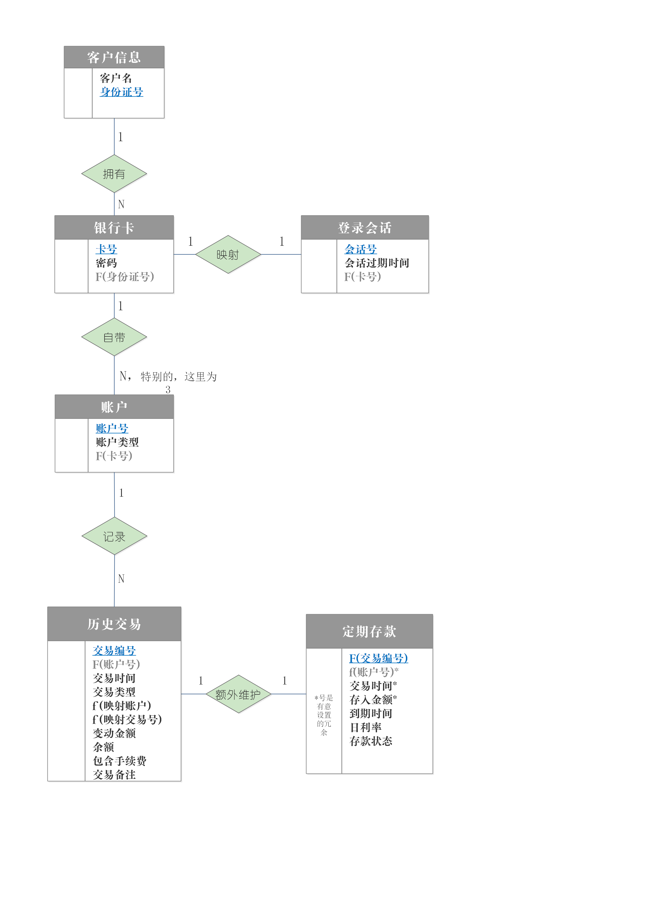

# ATM-Simulation-System
湖南大学(HNU)数据库系统课程大作业 ATM系统 前端基于Python的PyQt5，后端基于MySQL。这是一项小组设计项目，本人负责了MySQL的全部后端设计和大部分的前端编写。

> 本项目参考了@Er-Jia 的[PyQt5--ATM](https://github.com/Er-Jia/PyQt5--ATM)，在此致谢。

## 项目功能
项目功能基本参照了老师提供的参考题目功能需求：
> - 系统需要有确认用户(系统检验客户个人账户是否与客户的账户上记载的账户一致)功能，账户要有密码保护功能，只有输入相应的密码才可以进入该账户，登陆界面中密码框须使用‘*’保护。  
> - 用户登录后，进入服务选择界面，浏览各种服务，选择所需要的服务。服务包括(取款，存款，查询余额，转账，修改密码).
> - 取款：  
> 	- 进入取款后选择账户类型（活期账户，定期账户，信用卡帐户），选好账户类型后，提示该ATM机一次能取款的最大金额－2000元，该用户的一个帐户（用户可能有多个帐户）一天取款累计的最大金额为5000。  
> 	- 用户选择“取款”后，选取系统界面上的固定金额（500，1000，1500，2000），或是输入要取的金额，进行取款。  
> 	- 若是取款金额大于余额，提示余额不足；若是所取金额大于ATM机一次能取款的最大金额2000，给出提示，重新输入取款金额或是选择退卡；若是一天所取累计金额大于该帐户一天取款累计金额（5000）的限制，给出提示信息，重新输入取款金额或是选择退卡。  
> 	- 信用卡帐户可透支取款，透支额为2000元，其他帐户不允许透支取款。  
取款后，给出提示选择退卡或是继续服务。  
定期账户取款，如定期账户没有到期，一次取款交易收取手续费10元，从余额中扣除；活期账户取款，如当月取款交易数累计不大于5次（<=5），无交易手续费，如超过5次，一次取款交易收取手续费2元，从余额中扣除；信用卡帐户取款，业务规则无（不用实现）完成后用户可选择退卡或是继续选择服务。
> - 存款：（不要实现，提供菜单选项即可）
> - 查询余额：  
> 	- 选择帐户后，进入查询余额后，显示界面信息包括如下：  
> 	- 显示账户信息  
> 显示实际余额  
> 	- 显示可取款数额（5000减去当天已取款数）  
> 	- 完成后用户可选择退卡或是继续选择服务  
> - 转账：  
> 	- 进入转账后，（用下拉框，给出该客户所有帐户）用户选择转帐帐户源（该客户的一个帐户），及转帐目标账户（该客户的另一个帐户），以及转帐数额如转帐数额大于该帐户余额，给出提示信息，要求用户重新输入转帐数额；  
> 	- 转账服务按所转账的1%收取手续费，从余额中扣除，（若是余额不足，转账服务取消），转账一次的金额不能超过1万元；  
> 	- 完成后用户可选择退卡或是继续选择服务；  
> 	- 转帐交易包括两个交易事务，即从一帐户中取款和另一帐户中取款，这两个交易事务（Transaction）信息须记录到数据库。  
> - 修改密码：  
> 	- 进入修改密码选项，提示输入老密码，新密码，再次输入新密码进行确认修改，修改密码完成后选择退卡或是继续服务。  
> - 查询历史事务（Transactions）记录：
> 	- 进入查询历史交易选项，交易指取款、转帐、汇入帐户款等，应提供不同查询条件（例如最近的交易、近一个月交易，过去一年交易等），查询结果应包括交易类型、发生时间、数额）。  
> - 其他：
> 	- 所有发生的交易（Transaction），包括取款、转帐交易中取款和存入的交易事务，须记录到数据库（提示：包括1。帐，号2。交易类型－取款或存款，3。数额， 4。时间－年月日小时分钟）。


**一些功能的细节做了调整，详情见后端设计文档**

## 设计原理
### 后端设计原理
数据库关系模式设计图如下：

建立名为atm的数据库，在库内建立6个基本表，各个表之间通过外键联系。  
本项目后端没有显式的服务端封装，即不是传统的（客户端<->服务端<->数据库端）的模式，这带来了安全性相关的问题，如果在前端直接登录具有权限的账户执行select,insert,update等语句，那么如果前端软件遭到破坏后将会造成数据库管理权限的外泄，造成数据库入侵，带来威胁。
经过讨论，我们决定以数据库账户和权限为切入点，借由存储过程，模拟后端的接口封装。前端连接到数据库端的子账户仅能调用注册，登录，存取款等存储过程，实现更加细化的功能权限，而没有对任何基本表的通用增删改查权限。从而在一定程度上解决了软件被破坏数据库账号泄露等问题下的安全性问题。按照实验设计需求，数据库参考功能要求，共设置有8个存储过程。

MySQL数据库建表过程、存储过程功能接口设计说明见[后端设计报告](%E5%90%8E%E7%AB%AF%E8%AE%BE%E8%AE%A1%E6%8A%A5%E5%91%8A.pdf)

### 前端设计原理
参考项目[PyQt5--ATM](https://github.com/Er-Jia/PyQt5--ATM)

## 运行展示

| 界面种类     | 界面样式                                                     | 具体功能                                                     |
| ------------ | ------------------------------------------------------------ | ------------------------------------------------------------ |
| 初始界面     |  | 打开程序的初始界面。退出：退卡；开户：增加一个用户；登录：登录为已有用户。 |
| 注册界面     |  | 注册新的用户。需要姓名、身份证号（区别唯一）、密码。密码使用密文输入。 |
| 登录界面     |  | 进行登录，卡号为系统自动生成、给出，密码为开户时自行给出。密码使用密文输入。 |
| 账户选择界面 |  | 对账户进行选择，不同种类账户对账户操作要求不同。             |
| 服务选择界面 |  | 六种要求的服务与退卡选择。选择或完成服务后可选择回到此界面或直接退卡。 |
| 转账界面     |  | 默认以当前选择的账户作为转出账户，需确定转入账号的卡号和类型进行转账。 |
| 查询界面     |  | 前端从数据库中获取信息并进行显示。                           |
| 交易记录界面 |  | 三种查询方式，交易记录内容包括交易时间、交易类型、发起人或接收方、发起人或接收方类型、变动金额、余额、交易备注。 |
| 取款界面     |  | 取款必须整取，可定义具体取款金额。                           |
| 存款界面     |  | 存款必须整取，可定义具体存款金额。                           |
| 修改密码界面 |  | 新密码需要确认才能进行修改。密码使用密文输入。               |
| 退卡界面     |  | 退卡有倒计时，倒计时结束自动关闭。                           |

| 提示框类型       | 内容                                                         |
| ---------------- | ------------------------------------------------------------ |
| 开户成功提示     |  |
| 存款成功提示     |  |
| 取款金额错误提示 |  |


## 如何使用
### 若只测试功能
 1. 在本地安装MySQL 8.0.26 ,连接端口号默认3306。
 2. 通过一些管理工具,在root用户下运行[atm.sql](./atm.sql)创建atm数据库，内包含基本表，存储过程，定时事务。  
 3. 创建atm用户并给予存储过程调用权限：
   ```sql
   create user 'atm'@'%' identified by 'HNUdb';
flush privileges;
GRANT EXECUTE ON PROCEDURE atm.signup TO atm@'%';
GRANT EXECUTE ON PROCEDURE atm.login TO atm@'%';
GRANT EXECUTE ON PROCEDURE atm.inquiry TO atm@'%';
GRANT EXECUTE ON PROCEDURE atm.history TO atm@'%';
GRANT EXECUTE ON PROCEDURE atm.modify TO atm@'%';
GRANT EXECUTE ON PROCEDURE atm.save TO atm@'%';
GRANT EXECUTE ON PROCEDURE atm.withdraw TO atm@'%';
GRANT EXECUTE ON PROCEDURE atm.transfer TO atm@'%';
   ```
 4. 运行[release发布页面](https://github.com/siuze/ATM-Simulation-System/releases/tag/release)中的exe可执行文件即可进行使用
### 若进行项目编写测试
 1. 像上一节那样在适当的位置配置好数据库后端

 2. 本项目在Python3.9.6下运行，相关依赖包有：
> pycryptodome==3.14.1  
> PyMySQL==1.0.2  
> PyQt5==5.15.7  
> PyQt5-Qt5==5.15.2  
> PyQt5-sip==12.11.0  
> pyuic5-tool==0.0.1  

  可在pycharm下以项目打开ATM-pyQT5文件夹进行编写。
